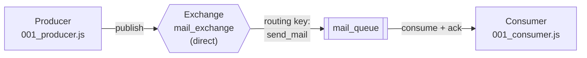

# Architecture 001 — One Producer, One Exchange, One Queue, One Consumer

The baseline topology: a single message goes into a single queue and is picked up by a single consumer.


## Topology at a glance

| Element | Value | Declared in |
|---|---|---|
| Exchange | `mail_exchange` (type `direct`) | `001_producer.js` |
| Routing key | `send_mail` | `001_producer.js` |
| Queue | `mail_queue` | both files |
| Payload | `{ to, from, subject, body }` as JSON | `001_producer.js` |

## Flow



1. **Producer** (`001_producer.js`) connects to `amqp://localhost`, opens a channel, and declares the topology: `assertQueue("mail_queue")`, `assertExchange("mail_exchange", "direct")`, then `bindQueue("mail_queue", "mail_exchange", "send_mail")`.
2. It publishes one message to the exchange under routing key `send_mail`, serialized with `Buffer.from(JSON.stringify(message))`.
3. **The direct exchange** compares the routing key against its bindings. `mail_queue` is bound with exactly `send_mail`, so the message is routed there.
4. **Consumer** (`001_consumer.js`) declares the same queue and blocks in `channel.consume`, parsing each delivery and calling `channel.ack(msg)`.

## Why the scripts are order-independent

Both files call `assertQueue` on `mail_queue`, and the producer also calls `assertExchange` and `bindQueue`. RabbitMQ's `assert*` calls are idempotent — they create the entity if missing and verify it if present. So whichever script starts first creates the queue; the second one finds it already there and proceeds.

This is also the mechanism behind a common failure: if the two files declared `mail_queue` with *different* arguments (e.g. one `durable: true` and one `durable: false`), the second script to start would have its channel closed by the broker with a `PRECONDITION_FAILED` error, because assert verifies as well as creates.

## Running it

Start the consumer first so the queue exists and something is listening, then publish:

```bash
# terminal 1
npx nodemon 001_consumer.js

# terminal 2
node 001_producer.js
```

Expected consumer output:

```
[x] Received mail: {
  to: 'hqfzn_2@telegmail.com',
  from: 'faizan97haque@gmail.com',
  subject: 'RabbitMQ test 2',
  body: 'This is a test mail 2'
}
```

The producer prints `Sent -> send_mail: RabbitMQ test 2`, waits 500 ms for the publish to flush, closes the channel and connection, and exits. The consumer keeps running until you kill it — it never closes its connection.

## Inspection

With the management plugin enabled (`rabbitmq:management` image), http://localhost:15672 shows `mail_exchange` under **Exchanges**, `mail_queue` under **Queues**, and the binding between them. Message counts reset to zero after the consumer acks, since acks remove messages from the queue.

## Notes

- The publish is not confirmed. `channel.publish` returns immediately and the 500 ms `setTimeout` is a timing assumption, not a delivery guarantee — there are no publisher confirms in this code.
- The queue is declared non-durable (`{ durable: false }`) while the message is published with `{ persistent: true }`. The persistent flag has no effect on a non-durable queue, so pending messages are lost on broker restart.
- The AMQP URL is hardcoded with no environment-variable override.
