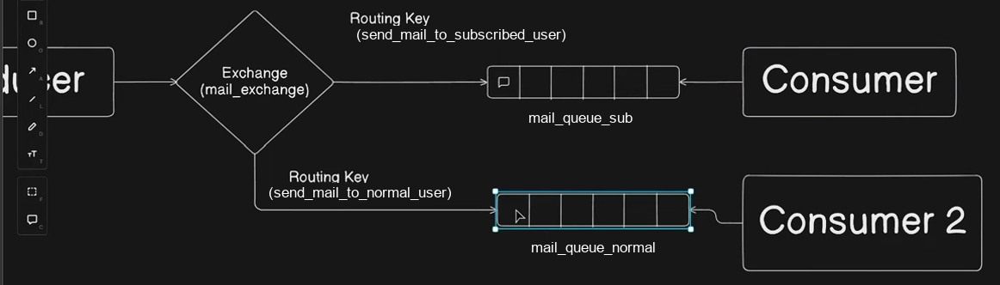
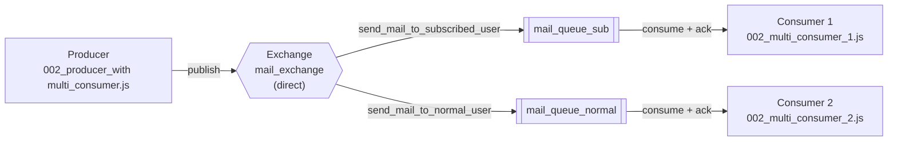

# Architecture 002 — One Producer, One Exchange, Two Queues, Two Consumers

Routing by recipient type: one exchange fans out to two queues, each served by its own consumer.



## Topology at a glance

| Element | Value | Declared in |
|---|---|---|
| Exchange | `mail_exchange` (type `direct`) | `"002_producer_with multi_consumer.js"` |
| Routing key A | `send_mail_to_subscribed_user` | producer + `002_multi_consumer_1.js` |
| Routing key B | `send_mail_to_normal_user` | producer + `002_multi_consumer_2.js` |
| Queue A | `mail_queue_sub` | `002_multi_consumer_1.js` |
| Queue B | `mail_queue_normal` | `002_multi_consumer_2.js` |

## Flow



1. The **producer** declares *both* queues, the exchange, and *both* bindings — so both queues exist and are wired up, whether or not their consumers are running.
2. It then publishes a single message. As written, it publishes only under `routingKeySubscribedUser`.
3. The **direct exchange** matches the routing key against each binding individually. `mail_queue_sub` is bound to `send_mail_to_subscribed_user`, so it receives the message; `mail_queue_normal` is bound to a *different* key and does not.
4. **Consumer 1** (`002_multi_consumer_1.js`) consumes `mail_queue_sub`; **Consumer 2** (`002_multi_consumer_2.js`) consumes `mail_queue_normal`. The two consumer files are otherwise identical — they differ only in which queue name they hardcode.

## How a direct exchange actually routes

This is the part the diagram can mislead on. A **direct** exchange delivers a message to every queue whose binding key *exactly equals* the message's routing key. It does not broadcast.

Consequences for this code:

- One `publish` call with one routing key reaches **one** queue. The second routing key is bound but idle.
- Running all three scripts, **Consumer 2 receives nothing** — `mail_queue_normal` stays empty because the producer never publishes to `send_mail_to_normal_user`.
- The message body says `subject: "I am a normal user"` / `body: "NORMAL user mail body"`, yet it is published to the *subscribed*-user routing key. That looks like a leftover from copy-pasting the two branches, and is worth correcting alongside the routing key.

## Making both queues receive a message

Pick one, depending on intent:

**Publish twice** — keep the direct exchange and send one message per routing key:

```js
for (const [key, subject, body] of [
    [routingKeySubscribedUser, "I am a subscribed user", "SUBSCRIBED user mail body"],
    [routingKeyNormalUser,     "I am a normal user",     "NORMAL user mail body"],
]) {
    channel.publish(
        exchange,
        key,
        Buffer.from(JSON.stringify({ ...message, subject, body })),
        { persistent: true }
    )
}
```

**Switch to a fanout exchange** — one publish reaches every bound queue. This is true broadcast: routing keys stop mattering, and the `bindQueue` calls can pass an empty key.

```js
await channel.assertExchange(exchange, "fanout", { durable: false })
await channel.bindQueue(mailQueueSubsUser, exchange, "")
await channel.bindQueue(mailQueueNormalUser, exchange, "")
```

Fanout changes the exchange's declared type, so if `mail_exchange` already exists on the broker as a `direct` exchange, the `assertExchange` call fails with `PRECONDITION_FAILED` until it is deleted. Either delete it from the management UI, or use a new exchange name.

**Switch to a topic exchange** — keep per-recipient routing while allowing wildcard bindings such as `send_mail_to_*`, which lets one publish satisfy both queues.

## Load balancing vs. fan-out

Note what this topology is *not*: two consumers on the **same** queue would load-balance (each message goes to exactly one of them, round-robin). Two consumers on **different** queues each get their own copy of whatever their own queue receives. This code is the second case — each consumer has a dedicated queue and a dedicated routing key, which is how you give different recipient types different handling.

## Running it

The producer's filename contains a space, so quote it in the shell.

```bash
# terminal 1
npx nodemon 002_multi_consumer_1.js

# terminal 2
npx nodemon 002_multi_consumer_2.js

# terminal 3
node "002_producer_with multi_consumer.js"
```

Consumer 1 prints the message; Consumer 2 prints nothing (see *How a direct exchange actually routes*). To verify the wiring is correct rather than silently broken, check http://localhost:15672 — both queues appear under **Queues** with their bindings visible, and `mail_queue_normal` simply shows zero messages.

## Notes

Same caveats as architecture 001, repeated here since these are independent copies of the same skeleton:

- No publisher confirms; the 500 ms `setTimeout` is a timing assumption.
- Queues are non-durable while messages are published `persistent: true` — the flag is inert, and pending messages are lost on broker restart.
- The AMQP URL is hardcoded in all three files with no environment-variable override.
- Every values-that-must-match set (exchange name, routing keys, queue names, `assertQueue` options) is duplicated across files with no shared module. A rename in the producer that misses a consumer breaks delivery silently — the message is published successfully and simply lands nowhere.
