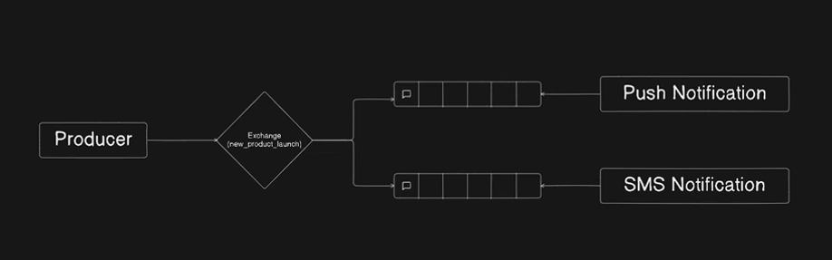
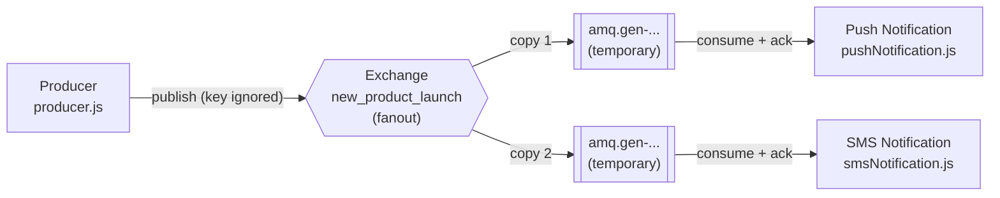

# Architecture — Fanout Exchange, One Producer, Two Notification Services

Broadcast: one product launch reaches every service that is listening, each through its own temporary queue.



## Topology at a glance

| Element | Value | Declared in |
|---|---|---|
| Exchange | `new_product_launch` (type `fanout`) | all three files |
| Routing key | none — the fanout ignores it | `producer.js` (publishes `""`) |
| Binding key | none — the fanout ignores it | both services (bind with `""`) |
| Queue | **server-generated** (`amq.gen-...`), one per service | each service, at startup |
| Queue lifetime | deleted when the declaring connection closes | `{ exclusive: true }` |

Neither the queue names nor the routing key appear anywhere in this directory except as an empty string — that is the point of the example.

## Flow



1. Each **service** starts, asserts the `new_product_launch` exchange, then calls `assertQueue("")`. The broker generates a unique name such as `amq.gen-JzTY20BRgKO-HjmUJj0wLg` and returns it.
2. The service binds that queue to the exchange with an empty binding key, then blocks in `channel.consume`.
3. The **producer** asserts the same exchange and publishes one message under the empty routing key.
4. The exchange copies the message into **every** queue bound to it — both temporary queues — so both services receive the same product launch independently.

## Why there is no routing key

Fanout is the one exchange type that does not look at the routing key at all. Both halves of the usual key/binding negotiation are inert:

- the producer's routing key is discarded, and
- the binding key passed to `bindQueue` is discarded.

The empty string in both places is convention, not a requirement — `"anything"` would behave identically. This is the contrast with the other two directories: a **direct** exchange matches the routing key exactly (one publish → one queue), a **topic** exchange matches it against wildcard patterns (one publish → every queue whose pattern matches), and a **fanout** exchange skips matching entirely (one publish → every bound queue, always).

If you find yourself passing a meaningful routing key to a fanout exchange, the message is going somewhere you did not intend — every bound queue gets it regardless of what you wrote.

## Why the queues have no names

`assertQueue("")` asks the broker to invent a name rather than supplying one, and `{ exclusive: true }` ties the queue's life to the connection that declared it. Together they produce the classic "temporary queue" of pub/sub messaging:

- Each service gets a **private** queue. Two runs of the same service never share one.
- The queue is **destroyed** when the service disconnects, so nothing accumulates on the broker between runs.
- Only the declaring connection may use it. Any other connection that tries to consume from `amq.gen-...` is rejected with `ACCESS_REFUSED` — which is precisely why the producer cannot and should not know the name.

The trade-off is the reason the other directories do it differently: **a queue that does not exist cannot hold a message.** Anything published while a service is disconnected is dropped by the exchange, because there is no queue bound for it to land in. Run the producer with no services listening and the message simply vanishes.

`direct_exchange/002` makes the opposite choice — fixed, durable queue names declared by the producer — so its messages wait in the queue until a consumer arrives. That costs the producer knowledge of every consumer's queue; this example buys decoupling with delivery guarantees. Neither is wrong; they are different points on the same curve. Getting both means fixed durable queue names *plus* a fanout exchange, which is what you would do in production for a launch broadcast.

## Broadcast, not load balancing

Two services, two queues: each message is delivered to **both**. That is fan-out.

It is worth contrasting with two consumers on the **same** queue, where RabbitMQ round-robins — each message goes to exactly one of them and the work is shared. Both patterns are common and they are not interchangeable: use separate queues when every service must see the event, and one shared queue when you are distributing work.

## Running it

Start both services **before** the producer. The queues only exist while a service is connected, so a launch announced before they are listening is dropped.

```bash
# terminal 1
npx nodemon fan_out_exchange/pushNotification.js

# terminal 2
npx nodemon fan_out_exchange/smsNotification.js

# terminal 3
node fan_out_exchange/producer.js
```

Expected output — both services log the **same** product, each from its own queue:

```text
[*] amq.gen-JzTY20BRgKO-HjmUJj0wLg waiting for new_product_launch broadcasts
[x] Push notification for Wireless Headphones: { productId: 1234, name: 'Wireless Headphones', status: 'launched' }

[*] amq.gen-Kd9mQ2xL8pVn4Rt6Yb1sCw waiting for new_product_launch broadcasts
[x] SMS notification for Wireless Headphones: { productId: 1234, name: 'Wireless Headphones', status: 'launched' }
```

The generated names differ every run, so yours will not match these.

## Verifying on the broker

http://localhost:15672 → **Exchanges** → `new_product_launch` shows two queue bindings while both services are running — the only place these queues can be inspected, since their names are not written down anywhere. Under **Queues** you will see both `amq.gen-...` entries; stop a service with Ctrl+C and its queue disappears immediately, which is the clearest demonstration that the queue belonged to that connection.

Note that the binding key in the UI shows as empty for the same reason the code passes `""`.

## Notes

- The exchange is declared `{ durable: false }`, which is coherent here: with no durable queue ever bound to it, a durable exchange would survive a broker restart only to have nothing to route to.
- Messages are published `{ persistent: true }`, which is **inert** — an exclusive queue is transient, so the flag has nothing to persist into. Same caveat as `direct_exchange/`. `topic_exchange/` is the directory where durability and persistence actually line up.
- No publisher confirms. The 500 ms pause before closing the channel is a timing assumption — here it is awaited, so the connection is not torn down mid-flush.
- Fanout ignores routing keys, so a typo in the key cannot break delivery here. What *can* break delivery is a service asserting a different exchange name or type: `assertExchange` verifies as well as creates, so a mismatch closes the channel with `PRECONDITION_FAILED` (406).
- The AMQP URL is hardcoded as `amqp://localhost` in all three files, with no environment-variable override and no credentials.
- Errors are caught and only `console.log`ged, so a failed connection leaves a service alive but idle and the producer exiting normally.
