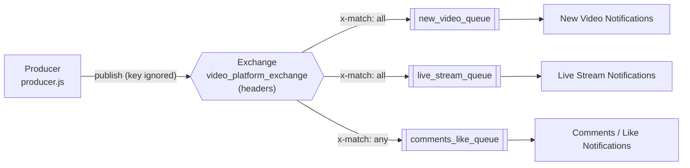

# Architecture — Headers Exchange, One Producer, Three Notification Services

Routing on message metadata rather than a key: the producer stamps each event with headers, and every service binds the exact header combination it cares about.

There is no diagram image for this directory yet — the other three topologies embed one. If you add a raster diagram, save it at the repo root as `header-exchange.png` and embed it here as `../header-exchange.png`.

## Topology at a glance

| Element | Value | Declared in |
|---|---|---|
| Exchange | `video_platform_exchange` (type `headers`) | all four files |
| Routing key | none — a headers exchange ignores it | every file passes `""` |
| Queue | `new_video_queue` | `newVideoNotifications.js` |
| Queue | `live_stream_queue` | `liveStreamNotifications.js` |
| Queue | `comments_like_queue` | `commentsLikeNotifications.js` |
| Binding arguments | see the vocabulary table below | each service, at startup |

## Flow



1. Each **service** starts, declares its own queue, then binds it to `video_platform_exchange` with an **arguments object** instead of a routing key. That object is the routing rule.
2. The **producer** declares the same exchange and publishes four events, each with a `headers` object attached to the publish options.
3. For every binding, the exchange takes the binding arguments, strips `x-match`, and compares the rest against the message headers. A queue receives the message when the comparison succeeds.
4. Each service logs only the events whose headers satisfied its own rule.

## The header vocabulary

Four events, three services: each event lands in exactly one queue, except that the last two both land in the same one. This table is the whole routing story:

| Event published | `notification-type` | other headers | Reaches |
|---|---|---|---|
| New video | `new-video` | `media-type: video` | `new_video_queue` |
| Live stream | `live-stream` | `media-type: video` | `live_stream_queue` |
| Comment | `comment` | `is-comment: true` | `comments_like_queue` |
| Like | `like` | `is-like: true` | `comments_like_queue` |

Each event lands in exactly one queue. Note that `media-type` appears on the two video events and is part of both video bindings — it is there to show `x-match: all` requiring *every* listed header, not just the interesting one.

## `x-match: all` versus `x-match: any`

`x-match` is the one argument the exchange treats as control rather than as a header to match:

| `x-match` | Meaning |
|---|---|
| `"all"` | every argument besides `x-match` must be present in the message headers and equal (this is the default if omitted) |
| `"any"` | at least one of them must be present and equal |

The two video services use `all`. If you published a new-video event with only `notification-type: new-video` and no `media-type`, it would match **neither** video service — the missing header fails the `all` test. That is the common surprise: a binding with several arguments is an AND, not a hint.

The third service uses `any`, because comments and likes are two different events that one team owns.

## Why the third service needs two header keys

This is the constraint that catches people out. The obvious binding for "comments or likes" would be:

```js
// does not work — and does not even do what it looks like
{ "x-match": "any", "notification-type": "comment", "notification-type": "like" }
```

A header key holds **one** value. In JavaScript the second entry silently overwrites the first, leaving a binding that matches only `like`; in AMQP there is no way to express "this key equals one of two values" at all. Header matching is per-key equality, so support for *or* across values of the same key does not exist.

The workaround is a second key, which is why the producer stamps `is-comment: "true"` or `is-like: "true"` alongside `notification-type`:

```js
{ "x-match": "any", "is-comment": "true", "is-like": "true" }
```

Adding a third engagement type means adding a third flag header, not extending a list.

## How matching compares values

Two rules are worth knowing before you write your own bindings:

- **Values must match in type as well as value.** A binding of `{ "count": 5 }` does not match a message header of `"count": "5"`. Every header used in this example is a string on both sides (`"true"`, `"video"`) deliberately, so there is no ambiguity to trip over.
- **Header names beginning with `x-` are reserved.** The matching engine skips them entirely, with `x-match` itself the sole exception. Naming a header `x-version` and binding on it will never match anything.

## Running it

Start all three services **before** the producer — the queues are declared by the services, so an event published while none of them is running has no queue to land in and is dropped.

```bash
# terminal 1
npx nodemon header_exchange/newVideoNotifications.js

# terminal 2
npx nodemon header_exchange/liveStreamNotifications.js

# terminal 3
npx nodemon header_exchange/commentsLikeNotifications.js

# terminal 4
node header_exchange/producer.js
```

Expected output — one event per service, except comments/like which receives two:

```text
[x] New video notification: { videoId: 101, title: 'RabbitMQ in 10 minutes', status: 'published' }

[x] Live stream notification: { streamId: 202, title: 'Live Q&A on exchanges', status: 'live' }

[x] Comments/like notification: { commentId: 303, videoId: 101, body: 'Great explanation' }
[x] Comments/like notification: { likeId: 404, videoId: 101 }
```

## Verifying on the broker

http://localhost:15672 → **Queues** → a queue → **Bindings** shows the binding arguments, which is the only place the routing rule is visible on the broker side. Headers exchanges are also where the management UI earns its keep: with no routing key to read, the arguments are the entire configuration.

## Notes

- **Bindings are additive, and this matters more here than anywhere else.** A binding is identified by queue + exchange + routing key + arguments. Change `bindingArgs` in a service and rebind, and the broker does not replace the old binding — it creates a *second* one, so the queue keeps receiving messages under the previous rule too. RabbitMQ has no "replace binding" call, so when you edit the arguments, delete the queue (which drops its bindings) and let the service recreate it. This is the headers-exchange counterpart to the `PRECONDITION_FAILED` trap on `assert*`.
- The exchange and queues are declared `{ durable: false }` and messages published `{ persistent: true }`, so the flag is inert — the same caveat as `direct_exchange/` and `fan_out_exchange/`.
- No publisher confirms. The 500 ms pause before closing the channel is a timing assumption; here it is awaited, so the four publishes stay ordered and the connection is not torn down mid-flush.
- A headers exchange ignores the routing key, so a typo in the key cannot break delivery. A typo in a **header name or value** breaks it silently instead — the message is published successfully and matches no binding.
- The AMQP URL is hardcoded as `amqp://localhost` in all four files, with no environment-variable override and no credentials.
- Errors are caught and only `console.log`ged, so a failed connection leaves a service alive but idle and the producer exiting normally.
