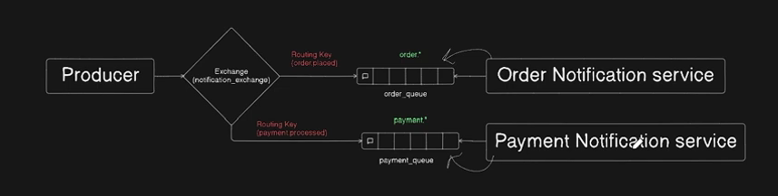
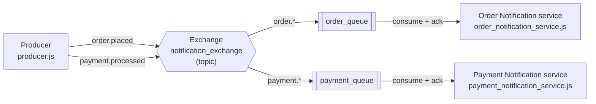

# Architecture — Topic Exchange, One Producer, Two Notification Services

An e-commerce notification fan-out: one producer publishes events, and each service picks up only the events it cares about by binding with a wildcard pattern.



## Topology at a glance

| Element | Value | Declared in |
|---|---|---|
| Exchange | `notification_exchange` (type `topic`, durable) | all three files |
| Routing key | `order.placed` | `producer.js` |
| Routing key | `payment.processed` | `producer.js` |
| Queue | `order_queue` (durable), bound with `order.*` | `order_notification_service.js` |
| Queue | `payment_queue` (durable), bound with `payment.*` | `payment_notification_service.js` |

## Flow



1. `main()` simulates the real-world flow by calling `publishNotification(routingKey, message)` **twice** — once for the order being placed, once for the payment being processed.
2. Each call opens its own connection and channel, declares `notification_exchange` as a **topic** exchange, publishes the JSON payload under the routing key it was handed, then closes.
3. The **exchange matches the routing key against the binding patterns** rather than against exact strings, so `order.placed` lands only in `order_queue` and `payment.processed` only in `payment_queue`.
4. Each service consumes its own queue and logs the routing key the message arrived under.

## Why the bindings live in the consumers

This is the point of the exercise, and it inverts the sibling `direct_exchange/` examples.

In `direct_exchange/002_*`, the **producer** declares the queues and the bindings, so it has to know every routing key up front and wires up queues nobody may ever read. Here the producer knows only the exchange name and its own routing keys — it has no idea which services exist, how many there are, or what they listen for.

Each consumer declares its own queue and its own binding pattern, which turns a binding into a **subscription**: "give me everything matching `order.*`". Adding a shipping-notification service later means adding one consumer file that binds `shipment.*` — the producer never changes. That decoupling is the reason to reach for a topic exchange.

## How wildcards route

A topic routing key is dot-separated words, and a binding pattern may contain two wildcards:

- `*` matches **exactly one** word
- `#` matches **zero or more** words

So the patterns as written behave like this:

| Message routing key | `order.*` | `payment.*` |
|---|---|---|
| `order.placed` | yes | no |
| `order.shipped` | yes | no |
| `payment.processed` | no | yes |
| `order.placed.v2` | **no** — two words where `*` allows one | no |

`order.placed.v2` is the case worth remembering: `order.*` does *not* match it, because `*` stands for a single word. `order.#` would match it and every other key starting with `order.`, at the cost of also swallowing anything deeper. Note that wildcards sit on the **binding** side only — the producer always publishes a concrete key like `order.placed`.

## Running it

Start both services **before** the producer. A topic exchange with no matching binding has nowhere to put the message, so anything published before `order_queue` exists is dropped silently rather than queued up.

```bash
# terminal 1
npx nodemon order_notification_service.js

# terminal 2
npx nodemon payment_notification_service.js

# terminal 3
node producer.js
```

Expected output — each service logs exactly one message:

```text
[*] order_queue waiting for order.* messages
[x] Received order.placed on order_queue: { orderId: 1234, status: 'placed' }

[*] payment_queue waiting for payment.* messages
[x] Received payment.processed on payment_queue: { paymentId: 5678, status: 'processed' }
```

The producer exits after both publishes; the consumers stay alive.

To confirm the wiring independently, open http://localhost:15672 → **Exchanges** → `notification_exchange` → **Bindings**: `order_queue` bound with `order.*`, `payment_queue` bound with `payment.*`.

## Durability and persistence

The exchange and both queues are declared `{ durable: true }`, and the producer publishes with `{ persistent: true }`. Those are two separate guarantees, and a message only survives a broker restart when both are in place:

| Declaration | What survives a restart |
|---|---|
| `assertExchange(..., { durable: true })` | The exchange and its bindings |
| `assertQueue(..., { durable: true })` | The queue itself, still bound |
| `publish(..., { persistent: true })` | The message body — but only while it sits on a durable queue |

An exchange never holds messages, so declaring it durable only stops the exchange and its bindings from vanishing on restart. The message guarantee comes from the queue and the `persistent` flag **together**: a non-persistent message on a durable queue is still lost, and a persistent message on a transient queue is lost with the queue. Unlike the sibling `direct_exchange/` examples — where non-durable queues made `{ persistent: true }` inert — the pair here actually lines up.

Persistence is also **asynchronous**. RabbitMQ batches disk writes, so a persistent message can sit in memory before it reaches disk. Without publisher confirms there is no way to know that a given message was written, which is what keeps the shutdown delay in the producer a timing assumption rather than a guarantee (see *Notes*).

**Upgrading an existing broker:** `durable` is part of the equivalence check that `assert*` performs, so if an entity already exists from an earlier run as non-durable, the next run fails with `PRECONDITION_FAILED` and the broker closes that channel:

```text
PRECONDITION_FAILED - inequivalent arg 'durable' for exchange 'notification_exchange'
in vhost '/': received 'true' but current is 'false'
```

The message names the offending entity, so delete just that one — in the management UI under **Queues** / **Exchanges**, or over the HTTP API, where `%2F` is the default vhost:

```bash
curl -u guest:guest -X DELETE "http://localhost:15672/api/exchanges/%2F/notification_exchange"
curl -u guest:guest -X DELETE "http://localhost:15672/api/queues/%2F/order_queue"
```

Nothing downstream of the failure runs. In the services the order is `assertQueue` → `assertExchange` → `bindQueue`, so a stale *exchange* leaves the queue created but **unbound**: it shows up in the UI with no bindings and receives nothing, however long the service waits. That is the state to check for whenever a service starts cleanly and then sits idle.

Restarting the broker also clears non-durable entities, though once the durable ones exist it takes them down with it.

## Notes

Same caveats as the other examples in this repo, since this is another independent copy of the same skeleton:

- No publisher confirms. The 500 ms pause before closing the channel is a timing assumption — here it is awaited, so the two publishes stay strictly ordered and neither connection is torn down mid-flush.
- Declarations are `{ durable: true }` and messages are published `{ persistent: true }` — the pairing described in *Durability and persistence* above, and consistent across all three files.
- The AMQP URL is hardcoded as `amqp://localhost` in all three files, with no environment-variable override and no credentials.
- Exchange name, routing keys, queue names, and the `assertExchange`/`assertQueue` options are duplicated across the three files with no shared module. The `assert*` arguments must match exactly — declaring `notification_exchange` as `direct` in one file while another says `topic` closes the second channel with `PRECONDITION_FAILED`.
- Errors are caught and only `console.log`ged, so a failed connection leaves the producer exiting normally and a service alive but idle.
